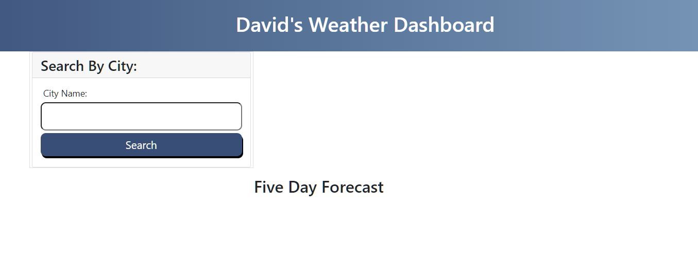
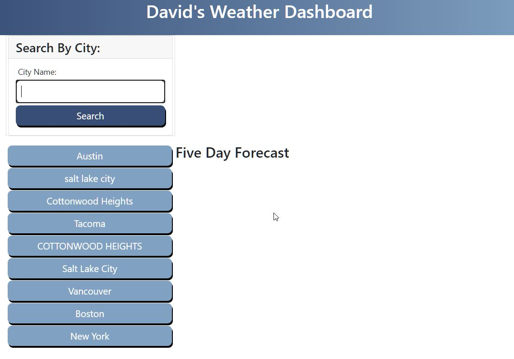
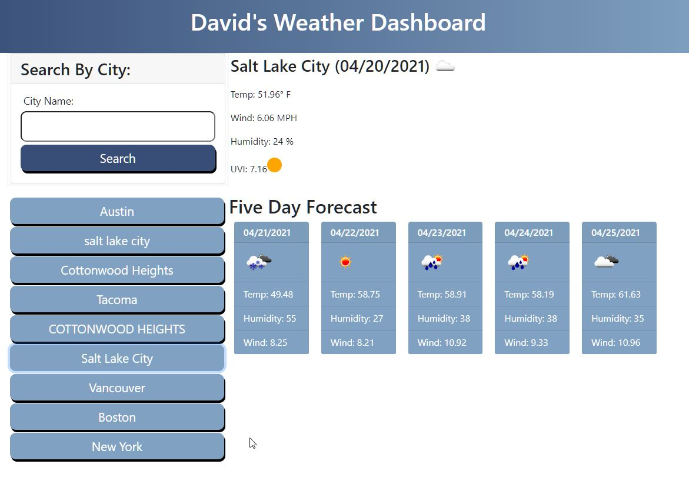

# Challenge 6: Server-Side APIs Challenge: Weather Dashboard

## About/Description

David's weather dashboard allows a user to search by a city.  The city value is passed into the openweather geo finder api to find the latitude and longitude of the city.  It then passes those values into the openweather forecast api where it loads the city name, current temp, wind speed, humidity, and UV index with a color dot for the user to read.  It will display the next five days in cards below for the user as well.  It uses moment.js to determine the date.  It uses local storage to create buttons for the user to click and search for that information again.     

### User/Story

AS A traveler
I WANT to see the weather outlook for multiple cities
SO THAT I can plan a trip accordingly

### Acceptance Criteria

GIVEN a weather dashboard with form inputs
WHEN I search for a city
THEN I am presented with current and future conditions for that city and that city is added to the search history
WHEN I view current weather conditions for that city
THEN I am presented with the city name, the date, an icon representation of weather conditions, the temperature, the humidity, the wind speed, and the UV index
WHEN I view the UV index
THEN I am presented with a color that indicates whether the conditions are favorable, moderate, or severe
WHEN I view future weather conditions for that city
THEN I am presented with a 5-day forecast that displays the date, an icon representation of weather conditions, the temperature, the wind speed, and the humidity
WHEN I click on a city in the search history
THEN I am again presented with current and future conditions for that city

## Built With
* HTML
* CSS
* Javascript
* JQuery
* Bootstrap
* Moment.js

## Live Link

https://https://ds1242.github.io/weather-dashboard/

## Screenshots

#### The page when opened with no search history:

#### Page open whe user has searched in the past

#### Information displayed to user after searching for a city

